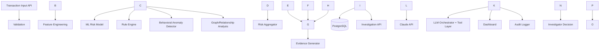

# RazorGuard

**AI Financial Risk \& Fraud Investigation Agent** — built for the Razorpay AI Buildathon 2026 (AI Risk Manager track).

RazorGuard doesn't just classify transactions as fraud/not-fraud. It scores risk with ML, explains *why* using rule-based, behavioral, and relationship-graph evidence, lets a fraud investigator interrogate that evidence in natural language through a tool-grounded LLM assistant, and produces a bounded, auditable recommendation — a human always makes the final call.

## Problem

Payment platforms process huge transaction volumes. Binary fraud classifiers flag transactions but give investigators no usable reasoning, no visibility into connected suspicious activity, and no audit trail — forcing slow, inconsistent, unexplainable manual review. RazorGuard is the investigation layer that sits on top of a classifier, which is where most real fraud systems actually fail today.

## Solution

For every transaction, RazorGuard combines four independent signals into one explainable risk score:

|Sub-system|What it measures|
|-|-|
|**ML model** (RandomForest)|Learned fraud probability from historical patterns|
|**Rule engine**|Deterministic, explainable threshold rules (e.g. "amount is 10x this customer's average")|
|**Behavioral anomaly detector**|Statistical deviation from *this specific customer's* own history (amount z-score, unusual hour, velocity)|
|**Graph/relationship analysis**|Whether this customer is connected to others via a shared device/IP (fraud ring detection, via NetworkX)|

An investigator can then ask an LLM assistant questions like *"Why was this flagged?"* or *"Is this customer connected to other suspicious accounts?"* — the LLM answers **only** from structured evidence returned by backend tool calls; it never determines fraud itself and never invents transaction facts.

## Architecture



**Key safety boundary:** the LLM never queries the database directly. It calls a fixed set of backend-defined tool functions (`get\_transaction`, `get\_risk\_evidence`, `get\_related\_entities`, etc.) that return structured JSON — this is what makes "no hallucinated transaction data" an enforceable backend property, not just a prompt instruction.

## Features

* Synthetic transaction data generator with 4 realistic fraud patterns + hard-negative legitimate cases
* Leakage-safe (causal, time-based) feature engineering shared between training and live scoring
* Two trained, honestly-evaluated models (LogisticRegression baseline + RandomForest)
* Deterministic rule engine + statistical behavioral anomaly detector + NetworkX graph analysis
* Weighted risk aggregation with confidence levels and bounded recommended actions (`monitor` / `manual\_review` / `escalate`)
* Full evidence trail per transaction, explaining every contributing signal
* LLM investigation assistant with 6 backend-controlled tools, grounded answers, and graceful "insufficient evidence" fallback
* Append-only audit log covering every scoring event, investigation question, and investigator decision
* Minimal but functional dashboard (transaction list, risk filters, detail view with evidence + chat + audit trail)
* Test suite covering rule engine, behavioral scoring, graph ring-detection, investigation tool error handling, and API smoke tests

## ML Approach

Synthetic data was chosen over public datasets (e.g. Kaggle's anonymized credit card dataset) because those have no interpretable features and no entity relationships — both required for our explainability and graph-analysis goals. See `ml/data/generate\_synthetic\_data.py` for the generator (fully documented, seeded, reproducible).

Models were compared honestly on a **time-based split** (train on earliest \~75% of days, test on most recent \~25%) — not a random split, because that's what production scoring actually looks like. All numbers below are from `ml/models/evaluation\_results.json`, generated by `ml/training/train\_and\_evaluate.py`; nothing here is fabricated.

|Model|Precision|Recall|F1|ROC-AUC|PR-AUC|FPR|
|-|-|-|-|-|-|-|
|LogisticRegression (baseline)|0.68|0.98|0.80|0.998|0.953|1.2%|
|RandomForest|0.97|0.94|0.95|1.000|0.994|0.08%|

RandomForest gives a real, explainable lift over the baseline by capturing feature interactions. **Honest caveat:** these numbers are on the high end of what real-world fraud systems achieve — synthetic fraud patterns, even with injected noise, are still cleaner than adversarial real-world fraud. See `LIMITATIONS.md` (coming in the documentation pass) for the full discussion.

## LLM Approach

The LLM is an **explainer and query interface**, never a classifier. Pattern: investigator question → Claude decides which backend tool(s) to call → backend executes the tool against the database → structured result returned → Google Gemini synthesizes a grounded answer. The system prompt explicitly instructs the LLM to say "insufficient evidence" rather than guess, and constrains any recommended action to a fixed vocabulary — the actual recommendation shown to investigators always comes from the deterministic risk engine, never from LLM free text.

## Evaluation

Full evaluation report with confusion matrices and business-impact discussion lands in `EVALUATION.md` during the documentation pass (Phase 5). Raw numbers are already captured in `ml/models/evaluation\_results.json`.

## Setup

```bash
git clone <repo>
cd razorguard
python -m venv venv \&\& source venv/bin/activate
pip install -r requirements.txt
cp .env.example .env   # SQLite works out of the box; set POSTGRES\_\* vars for Postgres
python manage.py makemigrations transactions risk evidence investigation audit
python manage.py migrate

# generate + train (or skip if ml/models/\*.joblib already present)
python ml/data/generate\_synthetic\_data.py --customers 2000 --avg-txns-per-customer 9 --days-span 120 --fraud-rate 0.025 --out ml/data/raw/transactions.csv
python ml/features/feature\_engineering.py
python ml/training/train\_and\_evaluate.py

python scripts/seed\_db.py          # loads synthetic data into the DB
python manage.py runserver
```

Then visit `http://localhost:8000/` for the dashboard, or use the API directly (see below).

**For the LLM assistant:** set `ANTHROPIC\_API\_KEY` in `.env`. Without it, the assistant returns a graceful "not configured, manual review required" response rather than failing.

## API (summary — full reference in `API.md`)

|Endpoint|Method|Purpose|
|-|-|-|
|`/api/transactions/`|POST|Ingest a transaction, run the full risk pipeline synchronously|
|`/api/transactions/{id}/`|GET|Transaction detail|
|`/api/transactions/{id}/risk/`|GET|Risk assessment|
|`/api/transactions/{id}/evidence/`|GET|Full evidence bundle|
|`/api/transactions/{id}/related/`|GET|Connected entities via graph analysis|
|`/api/transactions/{id}/action/`|POST|Record investigator decision (bounded)|
|`/api/transactions/{id}/audit/`|GET|Audit trail|
|`/api/investigate/{id}/ask/`|POST|Ask the LLM investigation assistant|
|`/api/dashboard/summary/`|GET|Aggregate risk counts|

## Testing

```bash
python manage.py test tests
```

## Limitations (honest, not hidden)

* Synthetic data only — no real transactions, so model metrics are likely optimistic relative to production fraud detection
* Graph analysis is scoped to direct + 2-hop device/IP sharing, not full community detection (Phase 4 future work)
* No SHAP/formal explainability tooling yet — explainability currently comes from rule/behavioral evidence descriptions and RandomForest feature importances
* Synchronous scoring (no background task queue) — fine at this scale, would need revisiting for high throughput
* Single-investigator role, no auth/multi-tenancy

## Future Improvements

Threshold calibration and cost-based operating point selection, SHAP-based model explainability, fraud-ring community detection beyond 2-hop neighborhoods, async scoring pipeline, multi-provider LLM abstraction, deployment to a managed host with PostgreSQL.

